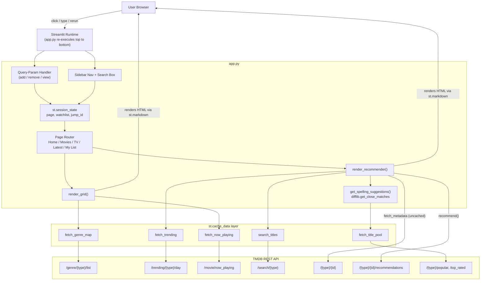

<div align="center">

# 🎬 PopFlix

**A Netflix-style movie & TV discovery app, built entirely in Streamlit.**

Search a title → see its details → get similar recommendations → save it to your list.
Typo in the title? PopFlix guesses what you meant.

[](https://streamlit.io)
[](https://www.python.org)
[](https://www.themoviedb.org/documentation/api)

</div>

---

## Table of Contents

- [Overview](#overview)
- [Features](#features)
- [Architecture](#architecture)
  - [High-Level Diagram](#high-level-diagram)
  - [Request Lifecycle](#request-lifecycle)
  - [Page Routing Model](#page-routing-model)
  - [Session State Model](#session-state-model)
  - [Caching Strategy](#caching-strategy)
  - [The "Did You Mean" Engine](#the-did-you-mean-engine)
- [Tech Stack](#tech-stack)
- [Project Structure](#project-structure)
- [Getting Started](#getting-started)
- [Configuration](#configuration)
- [TMDB Endpoints Used](#tmdb-endpoints-used)
- [Known Limitations](#known-limitations)
- [Roadmap](#roadmap)
- [License](#license)

---

## Overview

PopFlix is a single-file Streamlit application that turns the [TMDB API](https://www.themoviedb.org/documentation/api) into a Netflix-like browsing experience. It has no backend server, no database, and no build step — `streamlit run app.py` is the entire deployment story. All "backend" logic (routing, state, API calls, fuzzy search) lives inside one Python script and runs fresh on every interaction, which is the core mental model to understand before touching the code (see [Architecture](#architecture)).

## Features

| Feature | Description |
|---|---|
| 🔥 **Trending gallery** | Accordion-style "fan" of today's trending movies on Home; hover to expand, click to jump straight into that title |
| 🔎 **Search + recommendations** | Search any movie/TV show → poster, rating, genres, overview → a row of similar titles pulled from TMDB's `recommendations`/`similar` endpoints |
| ✨ **Spelling correction** | Typo'd a title? A fuzzy matcher (`difflib`) checks your query against a pool of popular/top-rated titles and offers clickable "Did you mean…" suggestions |
| ⭐ **My List** | Add/remove any title to a personal watchlist from anywhere in the app, via lightweight query-param links |
| 🎟️ **Now Playing** | Grid of movies currently in theaters |
| 📺 **Movies / TV tabs** | Dedicated recommender flow per media type |
| 🎨 **Netflix-dark theme** | Custom CSS injected via `st.markdown` — hover states, pill buttons, gradient hero cards |

## Architecture

### High-Level Diagram



### Request Lifecycle

Streamlit has no persistent server-side objects between interactions — **the entire script re-runs top to bottom on every click**. PopFlix's architecture is built around that constraint:

1. **Query params first.** Every rerun starts by checking `st.query_params` for an `action` (`add`, `remove`, `view`). These arrive from plain `<a href="?action=...">` links rendered inside HTML cards — a way to trigger backend state changes from static HTML without JavaScript. The handler mutates `st.session_state` and immediately calls `st.query_params.clear()` + `st.rerun()` so the action isn't replayed.
2. **Sidebar renders next**, including nav buttons and the search box. Clicking a nav button updates `st.session_state.page` and triggers a rerun.
3. **The router** (`if page == "Home": ...`) picks which page function to execute based on `st.session_state.page`.
4. **Page functions call cached TMDB fetchers** (`fetch_trending`, `search_titles`, etc.) to get data, then build HTML strings and hand them to `st.markdown(..., unsafe_allow_html=True)` for rendering.
5. **Any click inside that HTML** (a poster, a "+ List" button, a suggestion) is just another link back to step 1, or a native `st.button` that flips session state and reruns.

### Page Routing Model

There's no real router/URL scheme — `st.session_state.page` is a single string (`"Home"`, `"Movies"`, `"TV Shows"`, `"Latest"`, `"My List"`) that gates a big `if/elif` block at the bottom of `app.py`. Query params are repurposed as a secondary "action channel" (not page navigation) for add/remove/view — a `view` action does both: it sets `page` **and** stashes a `jump_id` so the destination page knows which title to auto-open.

### Session State Model

| Key | Type | Purpose |
|---|---|---|
| `page` | `str` | Which page function the router renders |
| `watchlist` | `list[tuple[id, media_type]]` | The user's "My List", scoped to the current browser session |
| `jump_id` / `jump_label` | `str` (transient) | Set by a `view` query-param action; consumed once by `render_recommender()` to auto-select a title, then popped |
| `presearch` | `str` (transient) | Carries the sidebar search box's text into the Movies page as a pre-filled query |
| `query_{media_type}` | `str` | Backing value for each search text input; also how "Did you mean" buttons rewrite the search box programmatically |

⚠️ All of this lives in memory for the duration of one browser session — nothing is persisted to disk or a database (see [Known Limitations](#known-limitations)).

### Caching Strategy

TMDB calls that return **stable-ish, shareable-across-users data** are wrapped in `@st.cache_data`:

- `fetch_genre_map`, `fetch_trending`, `fetch_now_playing`, `search_titles`, `fetch_title_pool`

`fetch_metadata()` (single-title detail lookup) is deliberately **not** cached, since it's called with dynamic, one-off IDs during recommendation rendering and caching every possible ID would offer little benefit.

### The "Did You Mean" Engine

TMDB's search endpoint doesn't do fuzzy/typo correction — an empty result set is a dead end. PopFlix works around this itself:

1. `fetch_title_pool()` pulls several pages of `popular` + `top_rated` titles per media type and caches them as a flat pool.
2. `get_spelling_suggestions()` runs the user's (lowercased) query through Python's built-in `difflib.get_close_matches` against that pool.
3. Matches render as `st.button` suggestions; clicking one overwrites `st.session_state["query_{media_type}"]` and reruns, feeding the corrected title straight back into `search_titles()`.

This means suggestions are grounded in real TMDB titles, but limited to whatever's in the popular/top-rated pool — a misspelled obscure indie title may not get a match.

## Tech Stack

- **[Streamlit](https://streamlit.io)** — UI framework and app runtime (no separate frontend/backend split)
- **[Requests](https://docs.python-requests.org)** — HTTP calls to TMDB
- **[TMDB API](https://www.themoviedb.org/documentation/api)** — movie/TV metadata, search, recommendations, trending, genres
- **`difflib`** (Python standard library) — fuzzy string matching for spelling suggestions
- **Raw HTML/CSS** injected via `st.markdown(..., unsafe_allow_html=True)` — used for all custom cards, the trending fan gallery, and the Netflix-dark theme, since Streamlit's native components don't support this level of layout control

## Project Structure

```
popflix/
├── app.py             # Entire application: routing, state, TMDB calls, UI, CSS
├── requirements.txt   # Python dependencies
└── README.md
```

`app.py` is intentionally a single file, organized top-to-bottom as:

```
imports & config
  └─ session state init
      └─ query-param action handler
          └─ TMDB fetch functions (cached)
              └─ spelling-suggestion engine
                  └─ global CSS block
                      └─ sidebar (nav + search)
                          └─ top bar
                              └─ render_recommender() / render_grid() (reusable UI builders)
                                  └─ page router (Home / Movies / TV Shows / Latest / My List)
```

## Getting Started

### Prerequisites

- Python 3.8+
- A [TMDB API key](https://www.themoviedb.org/settings/api) (free)

### Installation

```bash
git clone <your-repo-url>
cd popflix
pip install -r requirements.txt
```

**requirements.txt**
```
streamlit
requests
```

### Run the app

```bash
streamlit run app.py
```

Opens automatically at `http://localhost:8501`.

## Configuration

The app currently has a **hardcoded TMDB API key** in `app.py`. Before pushing to a public repo or deploying, switch to an environment variable:

```python
import os
TMDB_API_KEY = os.environ.get("TMDB_API_KEY")
```

Then set it locally:

```bash
export TMDB_API_KEY="your_key_here"     # macOS/Linux
setx TMDB_API_KEY "your_key_here"       # Windows
```

Or, on Streamlit Community Cloud, add `TMDB_API_KEY` under your app's **Secrets**.

## TMDB Endpoints Used

| Endpoint | Used for |
|---|---|
| `/genre/{media_type}/list` | Genre ID → name lookup for card labels |
| `/trending/{media_type}/day` | Home page "Trending now" fan gallery |
| `/movie/now_playing` | "Latest" page grid |
| `/search/{media_type}` | Title search |
| `/{media_type}/{id}` | Full metadata for a selected/hero title |
| `/{media_type}/{id}/recommendations`, `/{media_type}/{id}/similar` | "You may also like" row (falls back to `similar` if `recommendations` is empty) |
| `/{media_type}/popular`, `/{media_type}/top_rated` | Title pool for spelling-suggestion matching |

## Known Limitations

- **API key is hardcoded** — must be moved to env vars/secrets before public deployment.
- **No persistence** — the watchlist and all session state reset when the browser session ends; there's no database or file storage.
- **Spelling suggestions are pool-limited** — only titles in `popular`/`top_rated` are matchable.
- **No pagination** — search results are capped at 8, Now Playing at 12, with no "load more."
- **Single-user session model** — nothing is shared between users; deploying for multiple concurrent users means multiple independent watchlists, not a shared one.

## Roadmap

- [ ] Move TMDB API key to environment variables / Streamlit secrets
- [ ] Persist the watchlist (SQLite, file, or Streamlit's key-value storage) across sessions
- [ ] Add pagination for search results and the Now Playing grid
- [ ] Expand the spelling-suggestion pool with genre-based or trending titles
- [ ] Add loading skeletons instead of blank gaps during `st.spinner` calls
- [ ] Extract TMDB calls and UI builders into separate modules as the app grows

## License

Add your preferred license here (e.g. MIT).
