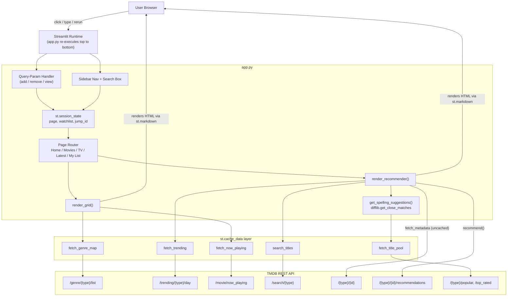

<div align="center">

# 🎬 PopFlix

**A Netflix-style movie & TV discovery app, built entirely in Streamlit.**

Search a title → see its details → get similar recommendations → save it to your list.
Typo in the title? PopFlix guesses what you meant.

[](https://streamlit.io)
[](https://www.python.org)
[](https://www.themoviedb.org/documentation/api)
[](https://popflix01.streamlit.app/)

### 🔗 [**Try it live → popflix01.streamlit.app**](https://popflix01.streamlit.app/)

</div>

## Overview

PopFlix is a single-file Streamlit application that turns the [TMDB API](https://www.themoviedb.org/documentation/api) into a Netflix-like browsing experience. It has no backend server, no database, and no build step — `streamlit run app.py` is the entire deployment story. All "backend" logic (routing, state, API calls, fuzzy search) lives inside one Python script and runs fresh on every interaction, which is the core mental model to understand before touching the code (see [Architecture](#architecture)).

## Features

| Feature | Description |
|---|---|
| 🔥 **Trending gallery** | Accordion-style "fan" of today's trending movies on Home; hover to expand, click to jump straight into that title |
| 🔎 **Search + recommendations** | Search any movie/TV show → poster, rating, genres, overview → a row of similar titles pulled from TMDB's `recommendations`/`similar` endpoints |
| ✨ **Spelling correction** | Typo'd a title? A fuzzy matcher (`difflib`) checks your query against a pool of popular/top-rated titles and offers clickable "Did you mean…" suggestions |
| ⭐ **My List** | Add/remove any title to a personal watchlist from anywhere in the app, via lightweight query-param links |
| 🎟️ **Now Playing** | Grid of movies currently in theaters |
| 📺 **Movies / TV tabs** | Dedicated recommender flow per media type |
| 🎨 **Netflix-dark theme** | Custom CSS injected via `st.markdown` — hover states, pill buttons, gradient hero cards |

## Architecture

### High-Level Diagram



## Tech Stack

- **[Streamlit](https://streamlit.io)** — UI framework and app runtime (no separate frontend/backend split)
- **[Requests](https://docs.python-requests.org)** — HTTP calls to TMDB
- **[TMDB API](https://www.themoviedb.org/documentation/api)** — movie/TV metadata, search, recommendations, trending, genres
- **`difflib`** (Python standard library) — fuzzy string matching for spelling suggestions
- **Raw HTML/CSS** injected via `st.markdown(..., unsafe_allow_html=True)` — used for all custom cards, the trending fan gallery, and the Netflix-dark theme, since Streamlit's native components don't support this level of layout control

## Project Structure

```
popflix/
├── app.py             # Entire application: routing, state, TMDB calls, UI, CSS
├── requirements.txt   # Python dependencies
└── README.md
```

`app.py` is intentionally a single file, organized top-to-bottom as:

```
imports & config
  └─ session state init
      └─ query-param action handler
          └─ TMDB fetch functions (cached)
              └─ spelling-suggestion engine
                  └─ global CSS block
                      └─ sidebar (nav + search)
                          └─ top bar
                              └─ render_recommender() / render_grid() (reusable UI builders)
                                  └─ page router (Home / Movies / TV Shows / Latest / My List)
```

## Getting Started

> 💡 Want to try it first without installing anything? **[Live demo → popflix01.streamlit.app](https://popflix01.streamlit.app/)**

### Prerequisites

- Python 3.8+
- A [TMDB API key](https://www.themoviedb.org/settings/api) (free)

### Installation

```bash
git clone <your-repo-url>
cd popflix
pip install -r requirements.txt
```

**requirements.txt**
```
streamlit
requests
```

### Run the app

```bash
streamlit run app.py
```

Opens automatically at `http://localhost:8501`.

## Configuration

The app currently has a **hardcoded TMDB API key** in `app.py`. Before pushing to a public repo or deploying, switch to an environment variable:

```python
import os
TMDB_API_KEY = os.environ.get("TMDB_API_KEY")
```

Then set it locally:

```bash
export TMDB_API_KEY="your_key_here"     # macOS/Linux
setx TMDB_API_KEY "your_key_here"       # Windows
```

Or, on Streamlit Community Cloud, add `TMDB_API_KEY` under your app's **Secrets**.
